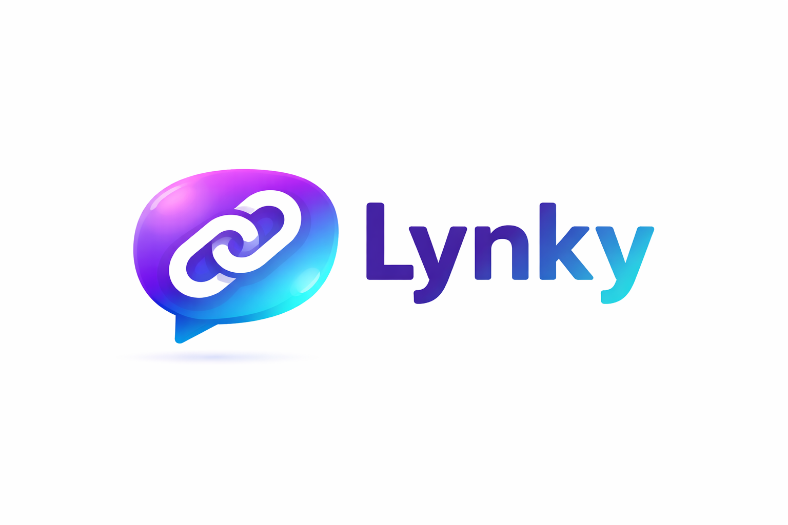

  <h1 style="color: #58a6ff; font-size: 2.5em; margin-bottom: 10px;">🔗 Lynky — Connect Beyond Random</h1>

  

    <strong>Lynky</strong> is a next-generation social chat platform inspired by Omegle — but built <em>smarter</em>, <em>deeper</em>, and <em>more human</em>. 
    Meet new people instantly, reconnect with past conversations, and explore who’s around you through an interactive map — all without revealing your real identity.
  

  

    
  

  <h2 style="color: #58a6ff; margin-bottom: 10px;">✨ Features</h2>
  <ul style="line-height: 1.8; color: #adbac7;">
    <li>🔄 <strong>Smart & Random Matching</strong> — Talk to new people instantly, powered by intelligent matching logic.</li>
    <li>💬 <strong>Real-Time Chat</strong> — Fast, smooth, and responsive conversations.</li>
    <li>🧠 <strong>Reconnect Anytime</strong> — Find and reconnect with people you’ve talked to before.</li>
    <li>🗺️ <strong>Interactive People Map</strong> — Discover users around you and connect beyond pure randomness.</li>
    <li>🔐 <strong>Privacy-First by Design</strong> — No real names. No personal data. Stay anonymous, stay safe.</li>
  </ul>

  <h2 style="color: #58a6ff; margin-bottom: 10px;">🧪 Status</h2>
  
Currently under active development. New features, performance improvements, and UI upgrades are coming soon.

  <h2 style="color: #58a6ff; margin-bottom: 10px;">🚀 Why Lynky?</h2>
  

    Most chat apps focus on endless randomness. 
    <strong>Lynky focuses on meaningful randomness.</strong> 
    It’s not just “next, next, next” — it’s <em>connect, remember, rediscover</em>.
  

